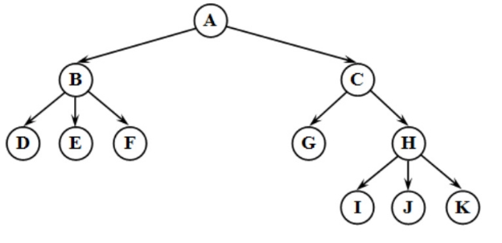
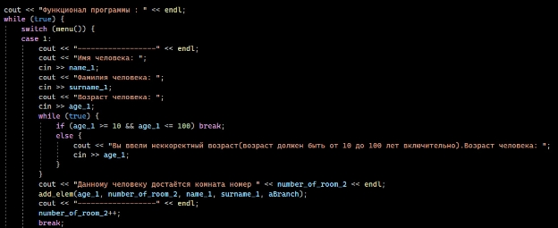
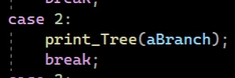

**Министерство науки и высшего образования Российской Федерации**

**федеральное государственное бюджетное**

**образовательное учреждение высшего образования**

**«Российский экономический университет имени Г.В. Плеханова»**

Институт цифровой экономики и информационных технологий

Базовая кафедра цифровой экономики института развития информационного общества


**КУРСОВАЯ РАБОТА**

по дисциплине «Алгоритмизация и программирование»

на тему «Использование деревьев для поиска»


Выполнил обучающийся группы 15.11Д-МОСИП12/21б

очной формы обучения 

Высшая школа кибертехнологий, 

математики и статистики
Степаниденко Д.Е.

Научный руководитель: 

ст. преподаватель Внукова Т.В.


Москва – 2022 г.

# Оглавление
# [ВВЕДЕНИЕ](#_toc105095957)

# [Глава 1. Выбор средств разработки программы и теория](#_toc105095958)

## [1.1 Выбор языка программирования](#_toc105095959)

## [1.2 Выбор приложения для разработки](#_toc105095960)

## [1.3 Общее понятие структуры данных](#_toc105095964)

## [1.4 Классификация структур данных](#_toc105095971)

## [1.5 Динамические структуры данных](#_toc105095980)

## [1.6 Классификация динамических структур данных](#_toc105096002)

## [1.7 Динамические структуры данных – деревья](#_toc105096003)

# [Глава 2. Разработка программы](#_toc105096023)

# [Глава 3. Тестирование программы](#_toc105096058)
# [Заключение](#_toc1)


# <a name="_toc105095957"></a>ВВЕДЕНИЕ


## Актуальность темы исследования

В настоящее время компьютеризация прочно вошла в нашу жизнь. Она проникла во все сферы экономики и народного хозяйства: промышленность, управление, банковское дело, торговлю.

Данный процесс помогает нам создавать всё больше и больше различных приложений и программ, которые помогают нам в повседневной жизни, и в работе. Как, например данная программа, которая предназначена для решения реальной бизнес задачи.

Представим, что вы - владелец гостиницы, и хотите увеличить количество клиентов. Для этого вы придумываете акцию. Каждый месяц в определённый день генератор случайных чисел выдаёт какое-то число – возраст человека. Если в вашей гостинице проживает человек с таким возрастом, то он получает в этот день бесплатный обед/ужин/завтрак по его желанию. Если таких людей несколько, то все они получают такой приятный подарок. Но работникам сложно самим следить, чтобы данная акция корректно существовала. Поэтому данная программа реализует всё для того, чтобы выполнение акции проходило автоматически.

## Цель и задачи курсовой работы

Целью курсовой работы является разработка, написание и тестирование программного средства для решения реальной бизнес задачи.

Особенностью данной программы является то, что её можно использовать для любой гостиницы. То есть данная программа не привязана к какому-то конкретному предприятию. Также если владелец гостиницы захочет ввести новые акции, то для этого нужно будет лишь дописать код уже к имеющийся программе, то есть она выступает здесь в роли фундамента, на которой будут держаться функционал акций.

Для реализации поставленной цели, необходимо решить следующие задачи: 

- изучить различную литературу по данной теме;
- описать понятия и особенности данной программы;
- разработка, написание и тестирование программы.

## Объект исследования

Алгоритмизация и программирование

## Предмет исследования

Использование динамических структур данных – деревьев, для создания программного средства для решения реальной бизнес задачи.

## Методы исследования

- эксперимент;
- синтез;
- системный подход;
- моделирование;
- структурно-функциональный метод.

## Структура работы

Первая глава курсовой работы посвящена теоретической части. В ней освещаются такие вопросы как выбор языка программирования, приложения для разработки, и основная теория по теме курсовой работы, а именно по динамическим структурам данным – деревьям.

Вторая глава рассказывает про процесс создания программы. Для полного понимания представлены фрагменты кода программы

В третьей главе рассматривается тестирование  программы. Создаются реальные условия, в которых происходит тестирование. Также представлены скриншоты работы программы. Результат тестирование показывает, что программа работает успешно и справляется с заданными задачами.

# <a name="_toc42962900"></a><a name="_toc43133193"></a><a name="_toc105095958"></a>Глава 1. Выбор средств разработки программы и теория

## 1. <a name="_toc42962901"></a><a name="_toc43133194"></a><a name="_toc105095959"></a>Выбор языка программирования

Перед написанием программы встаёт вопрос про язык программирования. Существует много функциональных языков программирования, которые бы хорошо справились с поставленной задачей. Но для написания курсовой работы был выбран язык C++.Выбор объясняется тем, что как раз его мы и изучали на первом курсе, было прослушано много лекций и проработано много семинаров, поэтому фундамент знаний уже присутствовал.

C ++ - это статически типизированный, скомпилированный, универсальный, учитывающий регистр, язык программирования свободной формы, который поддерживает процедурное, объектно-ориентированное и общее программирование.

Первые версии языка C++ (си-плюс-плюс, еще его называют «си-пи-пи» и «плюсы») появились в начале 1980-х годов. Их создатель — датский программист из компании Bell Laboratories Бьерн Страуструп. Он моделировал распределения вызовов по АТС (автоматическим телефонным станциям).

Тогда у Страуструпа было два типа языков: низкоуровневые и языки на основе Фортрана или Алгола, которые были очень медленными.

Страуструп объединил возможности объектно-ориентированного С и языка Simula, основанного на Алголе. Главное привнесенное в C новшество — классы, основной элемент в объектно-ориентированном программировании, содержащий в себе данные и код, который ими управляет.

Так появился «‎C с классами»‎ или «‎новый C»‎, который в 1983 году получил свое окончательное название — C++. «++» — это оператор, который означает «добавить единицу». То есть к возможностям языка C добавили еще одну.

## 2. <a name="_toc42962902"></a><a name="_toc43133195"></a><a name="_toc105095960"></a>Выбор приложения для разработки

<a name="_toc105095961"></a>При написании курсовой работы в качестве приложения для разработки был выбран Visual Studio. 

<a name="_toc105095962"></a>Visual Studio — это стартовая площадка для написания, отладки и сборки кода, а также последующей публикации приложений. Помимо стандартного редактора и отладчика, которые есть в большинстве сред IDE, Visual Studio включает в себя компиляторы, средства авто завершения кода, графические конструкторы и многие другие функции для улучшения процесса разработки. Также VS поддерживает много языков программирования, таких как C++, C#, JavaScript,C и другие.

<a name="_toc105095963"></a>Также удобно, что кроме написания кода вы можете заниматься отладкой вашей программы, проверять её на работоспособность. Ещё очень удобная и важная функция, встроенная в VS, это поиск ошибки, которую вы допустили в коде, в интернете. То есть если вы нарушили либо правила синтаксиса, либо допустили логическую ошибку в программе, то вы можете почитать об этом на отдельной странице в интернете. Данная функция очень упрощает устранение неполадок.

## 3. <a name="_toc105095964"></a>Общее понятие структуры данных

<a name="_toc105095965"></a>Дать какое-то простое определение данному термину сложно, так как понятие структуры данных является фундаментальным

<a name="_toc105095966"></a>Структуры данных – совокупность физически (переменные) и логически (алгоритм, функция) взаимосвязанных переменных и их значений.

<a name="_toc105095967"></a>Различают простые структуры данных и интегрированные. 

<a name="_toc105095968"></a>Простые структуры данных – такие структуры, которые невозможно разделить составные компоненты, больше, чем биты. Согласны их физической структуре, важной характеристикой является то, что заранее известен размер данного простого типа и его структура размещения в памяти. Исходя из прошлых утверждений можно сделать вывод, что простые данные является неделимыми единицами.

<a name="_toc105095969"></a>Интегрированные структуры данных – такие структуры, имеющие в составе другие структуры данных , в том числе простые и интегрированные. Разработкой таких структур данных занимаются программисты. В процессе они применяют средства интеграции данных, представляемые языком программирования.

<a name="_toc105095970"></a>Стоит отметить, что понятие структуры данных распространяется не только на переменные, из которых она состоит, но и на алгоритмы (функции), связывающие переменные между собой согласно логике, и определяющие внутренние значения, свойственные рассматриваемой структуре данных.

Структура данных играет роль исполнителя, организуя работу с данными, включая:

- хранение;
- добавление;
- удаление;
- модификацию;
- поиск.

  На самом деле структуру данных можно рассматривать как библиотеку. Описание структуры данных основано на перечислении набора операций, возможных для нее, и описании итога каждого действия, называемого предписанием. С точки зрения программы, системе предписаний структуры данных соответствует набор функций, работающих над общими переменными.

 ## 3. <a name="_toc105095971"></a>Классификация структур данных

<a name="_toc105095972"></a>Важный признак структуры данных - характер упорядоченности ее элементов. По этому признаку структуры можно делить на линейные и нелинейные структуры. В зависимости от характера взаимного расположения элементов в памяти линейные структуры можно разделить на структуры с последовательным распределением элементов в памяти (векторы, строки, массивы, стеки, очереди) и структуры с произвольным связным распределением элементов в памяти (односвязные, двусвязные списки). Весьма важный признак структуры данных - ее изменчивость - изменение числа элементов и (или) связей между элементами структуры. В определении изменчивости структуры не отражен факт изменения значений элементов данных, поскольку в этом случае все структуры данных имели бы свойство изменчивости. По признаку изменчивости различают структуры статические, полустатические, динамические.

<a name="_toc105095973"></a>Статические структуры относятся к разряду  структур, которые, фактически, представляют собой  множество примитивных, базовых, структур. Например, вектор может быть представлен упорядоченным множеством чисел. Поскольку по определению статические структуры отличаются отсутствием изменчивости, память для них выделяется автоматически - как правило, на этапе компиляции или при выполнении - в момент активизации того программного блока, в котором они описаны. Статические структуры в языках программирования связаны со структурированными типами. Структурированные типы в языках программирования являются теми средствами интеграции, которые позволяют строить структуры данных сколь угодно большой сложности. К таким типам относятся: массивы, записи  и множества.

## 4. <a name="_toc105095974"></a>**Полустатические структуры данных.**

<a name="_toc105095975"></a>Полустатические структуры данных характеризуются следующими признаками:

- <a name="_toc105095976"></a>они имеют переменную длину и простые процедуры ее изменения;
- <a name="_toc105095977"></a>изменение длины структуры происходит в определенных пределах, не превышая какого-то максимального (предельного) значения.

<a name="_toc105095978"></a>Если полустатическую структуру рассматривать на логическом уровне, то о ней можно сказать, что это последовательность данных, связанная отношениями линейного списка. Доступ к элементу может осуществляться по его порядковому номеру. Физическое представление полустатических структур данных в памяти - это обычно последовательность слотов в памяти, где каждый следующий элемент расположен в памяти в следующем слоте (т.е. вектор). 

<a name="_toc105095979"></a>Но в задаче, которая рассматривается в курсовой работе будут использоваться динамические структуры данных, а именно деревья. Поэтому сейчас мы немного углубился в понятие о динамических структурах данных.

## 5. <a name="_toc105095980"></a>**Динамические структуры данных**

<a name="_toc105095981"></a>Динамические структуры данных – это структуры данных, память под которые выделяется и освобождается по мере необходимости.

<a name="_toc105095982"></a>Данные структуры данных основываются на двух элементах языка программирования

- <a name="_toc105095983"></a>динамических переменных, количество которых может меняться и в конечном счете определяется самой программой;
- <a name="_toc105095984"></a>указателях<a name="24"></a>, которые обеспечивают непосредственную взаимосвязь данных и возможность изменения этих связей.

<a name="_toc105095985"></a>Динамические структуры данных в процессе своего существования в памяти могут менять даже характер связей между элементами, при этом не учитывается изменение содержимого самих элементов. Такая особенность приводит к тому, что на этапе создания машинного кода компилятор не может выделить для всей структуры участок памяти фиксированного размера. Рассмотрим основные характеристики таких структур данных:

- <a name="_toc105095986"></a>она не имеет имени;
- <a name="_toc105095987"></a>ей выделяется память в процессе выполнения программы;
- <a name="_toc105095988"></a>количество элементов структуры может не фиксироваться;
- <a name="_toc105095989"></a>размерность структуры может меняться в процессе выполнения программы;
- <a name="_toc105095990"></a>в процессе выполнения программы может меняться характер взаимосвязи между элементами структуры.

<a name="_toc105095991"></a>Каждой динамической структуре данных сопоставляется статическая переменная типа указатель. Её значение и есть адрес этого объекта. Сами указатели требуют описания в программе, так как являются статическими переменными. А вот сами динамические величины не требуют описания в программе, так как память под них во время компиляции не выделяется. Поскольку элементы динамической структуры располагаются по непредсказуемым адресам памяти, <a name="keyword27"></a>адрес элемента такой структуры не может быть вычислен из адреса начального или предыдущего элемента. Для установления связи между элементами динамической структуры используются указатели, через которые устанавливаются явные связи между элементами. Такое <a name="keyword28"></a>представление данных в памяти называется связным. Достоинства связного представления данных – в возможности обеспечения значительной изменчивости структур:

- <a name="_toc105095992"></a>размер структуры ограничивается только доступным объемом машинной памяти;
- <a name="_toc105095993"></a>при изменении логической последовательности элементов структуры требуется не перемещение данных в памяти, а только коррекция указателей.

<a name="_toc105095994"></a>Но также имеется и ряд недостатков, ключевые среди которых:

- <a name="_toc105095995"></a>на поля, содержащие указатели для связывания элементов друг с другом, расходуется дополнительная память;
- <a name="_toc105095996"></a>доступ к элементам <a name="keyword30"></a> связной структуры  может быть менее эффективным по времени.

<a name="_toc105095997"></a>Последний недостаток является наиболее серьезным и именно им ограничивается применимость связного представления данных. Cвязное<a name="keyword35"></a> представление практически никогда не применяется в задачах, где<a name="keyword36"></a> логическая структура данных имеет вид вектора или массива – с доступом по номеру элемента, но часто применяется в задачах, где<a name="keyword37"></a> логическая структура требует другой исходной информации доступа.

<a name="_toc105095998"></a>Порядок работы с <a name="keyword38"></a>динамическими структурами данных следующий:

- <a name="_toc105095999"></a>создать (отвести место в динамической памяти);
- <a name="_toc105096000"></a>работать при помощи указателя;
- <a name="_toc105096001"></a>удалить (освободить занятое структурой место).

#  <a name="_toc105096002"></a>Классификация динамических структур данных

Различают следующие динамические структуры данных:

- однонаправленные (односвязные) списки;
- <a name="keyword40"></a>двунаправленные (<a name="keyword41"></a>двусвязные) списки;
- циклические списки;
- стек;
- <a name="keyword42"></a>дек;
- очередь;
- <a name="keyword43"></a>бинарные деревья.

Они отличаются способом связи отдельных элементов и допустимыми операциями. В задаче, которая рассматривается в курсовой работе, будут использоваться деревья(бинарные деревья).Поэтому сейчас углубимся в теорию о деревьях.

## 1. <a name="_toc105096003"></a>Динамические структуры данных – деревья

<a name="_toc105096004"></a>Деревья являются одними из наиболее широко распространенных структур данных в <a name="keyword5"></a>информатике и программировании, которые представляют собой иерархические структуры в виде набора связанных узлов.

<a name="_toc105096005"></a>Дерево – это <a name="keyword6"></a>структура данных, представляющая собой совокупность элементов и отношений, образующих иерархическую структуру этих элементов. Каждый элемент дерева называется вершиной (узлом) дерева. Вершины дерева соединены направленными дугами, которые называют ветвями дерева. Начальный узел дерева называют корнем дерева, ему соответствует нулевой уровень. Листьями дерева называют вершины, в которые входит одна<a name="keyword7"></a> ветвь и не выходит ни одной ветви.

<a name="_toc105096006"></a>Дерево является частным случаем графа, а именно это связный граф без циклов.

<a name="_toc105096007"></a>Дерево очень часто применяется на практике. У каждого в школе было задание составить генеалогические деревья, так вот это как раз и есть пример дерево. Пример генеалогического дерево предоставлен на рисунке 1.



**Рисунок 1.Дерево**

<a name="_toc105096009"></a>Все вершины, в которые входят ветви, исходящие из одной общей вершины, называются потомками, а сама <a name="keyword9"></a>вершина – предком. Корень дерева не имеет предка, а <a name="keyword11"></a>листья дерева не имеют потомков. Высота (глубина) дерева определяется количеством уровней, на которых располагаются его вершины. <a name="keyword12"></a>Высота пустого дерева равна нулю. Поддерево – часть древообразной структуры данных, которая может быть представлена в виде отдельного дерева. Степенью вершины в дереве называется количество дуг, которое из нее выходит.

<a name="_toc105096010"></a>Упорядоченное дерево – это <a name="keyword19"></a>дерево, у которого ветви, исходящие из каждой вершины, упорядочены <a name="keyword20"></a>по определенному критерию. Как раз далее для решения задачи будет использоваться упорядоченное дерево, так как благодаря тем самым определённым критериям, поиск в упорядоченном дереве происходит очень эффективно.

<a name="_toc105096011"></a>Деревья являются рекурсивными структурами, так как каждое <a name="keyword21"></a>поддерево также является деревом. Таким образом, <a name="keyword22"></a>дерево можно определить как рекурсивную структуру, в которой каждый элемент является:

- <a name="_toc105096012"></a>либо пустой структурой;
- <a name="_toc105096013"></a>либо элементом, с которым связано конечное число поддеревьев.

<a name="_toc105096014"></a>Каждый элемент дерева имеет <a name="keyword24"></a>поле данных и два поля указателей: <a name="keyword25"></a>указатель на начало списка потомков вершины и <a name="keyword26"></a>указатель на следующий элемент в списке потомков текущего уровня. При таком способе представления дерева обязательно следует сохранять указатель на вершину, являющуюся корнем дерева.

<a name="_toc105096015"></a>Для того, чтобы выполнить определенную операцию над всеми вершинами дерева необходимо все его вершины просмотреть. Такая задача называется обходом дерева.

<a name="_toc105096016"></a>Сейчас мы рассмотрим вид дерева, которое будет использоваться при решении задачи, а именно это бинарное дерево.

<a name="_toc105096017"></a>Бинарное (двоичное) дерево – это <a name="keyword33"></a>динамическая структура данных, представляющее собой <a name="keyword34"></a>дерево, в котором каждая вершина имеет не более двух потомков.

<a name="_toc105096018"></a>Таким образом, бинарное дерево состоит из элементов, каждый из которых содержит информационное поле и не более двух ссылок на различные бинарные поддеревья. На каждый элемент дерева имеется ровно одна ссылка.

<a name="_toc105096019"></a>**Рис. 1.2 Организация бинарного дерева**

<a name="_toc105096020"></a>При написании программы в курсовой работе будут использоваться не просто бинарные деревья, а упорядоченные бинарные деревья(Рисунок 2)


**Рисунок 2.Организация бинарного дерева**

<a name="_toc105096021"></a>Упорядоченное дерево – это <a name="keyword88"></a>дерево, у которого ветви, исходящие из каждой вершины, упорядочены <a name="keyword89"></a>по определенному критерию. Это сделано для упрощения поиска по дереву. Например для каждого узла все ключи его правого поддерева строго больше ключа этого узла(в контексте моей задаче будет больше или равно), а все ключи его левого поддерева меньше.

<a name="_toc105096022"></a>После данной теории можно приступить к разработке программы.


# <a name="_toc105096023"></a>Глава 2. Разработка программы

<a name="_toc105096024"></a>Стоит начать с самого простого – со структуры нашего дерева(Рисунок 3)


<a name="_toc105096025"></a>**Рисунок 3.Структура Дерева**

<a name="_toc105096026"></a>Как мы видим инициализация дерева начинается со слов struct Branch. Таким образом мы создаём свою структуру. Как мы ранее говорили, каждая такая структура содержит информационное поле и ссылки на другие элементы структур. В контексте нашей задачи нам важно хранить возраст, имя, фамилию человека и номер его комнаты. Также Branch\* leftBranch хранит в себе ссылку на левое поддерево, а Branch\* rightBranch хранит в себе ссылку на правое поддерево.

<a name="_toc105096027"></a>Также нам понадобится меню, чтобы мы могли вызывать команды из функционала нашей программы. Реализуем это с помощью функции int menu()(Рисунок  4)


**Рисунок 4.Функция menu()**

<a name="_toc105096028"></a>Как мы видим функция будет выводить несколько сообщений, в которых пользователю будут предложены попробовать несколько функций. Для того, чтобы выбрать некоторую функцию, то нужно ввести соответствующее число. Данное число записывается в переменную x и возвращается с помощью return, и потом выполняется соответствующая функция. Как будет реализовываться выбор команд будет показано далее.

<a name="_toc105096029"></a>Перед тем как приступить к реализации функций, то скажем, что когда мы будем вызывать функции, и передавать им ссылку на первый элемент нашего дерева, то может быть так, что дерево будет пустым ещё. Поэтому перед тем как использовать функции, всегда будем просить пользователя ввести данные первого клиента в гостинице, что будет означать для нас создания первого узла в дереве, и не будет такой ситуации, что мы передадим пустое дерево в программу.

<a name="_toc105096030"></a>Но перед тем как писать начало программы нужно позаботиться об инициализации переменных которые далее будем использовать в программе, а также позаботимся о корректном вводе и выводе русских символов(Рисунок 5).


**Рисунок 5.Инициализация переменных**

<a name="_toc105096031"></a>Функции SetConsoleCP(1251) и SetConsoleOutput(1251) ,а также setlocale(…) отвечают за корректный ввод и вывод русских символов. Branch \*aBranch = new Branch создаёт новую структуры данных Branch, которую мы инициализировали чуть выше. Другие переменные будут использоваться для ввода данных с клавиатуры. По названию переменных можно понять что в них будет храниться информация о имени, фамилии, возрасте человека. Также номер комнаты будет выдаваться линейно, то есть каждому следующему клиенту номер на единицу выше, чем у предыдущего (можно сделать программу намного сложнее, чтобы был выбор у клиента, но это уже за пределами данной задачи и темы курсовой, так как в данном случае использование деревьев будет неудобно). Изначально значение переменной, которая хранит номер комнаты сделаем равной 1. Функция srand(time(NULL)) нужна для корректной работы генератора случайных чисел, который используется далее. Теперь приступим к созданию дерева, а то есть к записи первого клиента в гостиницу(Рисунок 6).


<a name="_toc105096032"></a>**Рисунок 6.Запись первого клиента**

<a name="_toc105096033"></a>Используем цикл while(true) ,так как нам важно чтобы дерево было создано, то есть был записан первый клиент, ибо работать с пустым деревом не имеет смысла. Вначале мы предлагаем пользователю ввести число 1, для того, чтобы записать первого клиента, если будет введена не 1, вопрос пользователю повторится, для этого и создавался бесконечный цикл. Если пользователь введёт 1, то ему предложат ввести имя человека, его фамилию и возраст. Далее эти данные мы записываем в узел нашего дерева. Для этого используем конструкцию aBranch->(название переменной). В конце не забываем обнулить ссылки на левое поддерево и на правое поддерево и также увеличить номер комнаты для последующего клиента. Теперь нужно сказать с помощью чего мы будем реализовывать все функции – здесь нам на помощь приходит конструкция switch() .Ранее мы написали функции int menu() которая возвращается какое-то целочисленное значение, и как раз с помощью switch мы будем вызывать функции, которые хочет пользователь. Посмотрим на самую первую из них – это запись нового клиента в гостиницу(Рисунок 7). 



**Рисунок 7.Добавление нового клиента. Инструкции в switch**

<a name="_toc105096034"></a>Как мы видим ,чтобы добавить нового клиента пользователь должен ввести 1. Далее пользователю предлагается ввести данные клиента .Обратим внимание что пользователь обязан ввести корректный возраст, так как по правилам гостиницы возраст человека должен быть от 10 до 100( в принципе это ограничение можно поменять, но это не суть самой программы, мелкие корректировки можно внести при желании). И далее вызывается функция add\_elem ,которая в принципе и добавит нового пользователя. Перейдём к ней(Рисунок 8)


**Рисунок 8.Функция add\_elem**

<a name="_toc105096035"></a>На вход этой функции поступает как раз ссылка на дерево, и все данные которые нам нужны. Стоит для начала сказать, что у нас упорядоченное бинарное дерево, и оно упорядоченно по возрасту. То есть в правое поддерево мы будем добавлять элемент если возраст человека, которого мы хотим добавить больше или равен возрасту текущего человека, который записан в текущий узел, если меньше, то в левое поддерево. Первый if отвечает за то, что если возраст совпал с текущим в данном узле, то тогда мы должны создаём новый узел, который будет в правом поддерева текущего узла и добавляем данные. Также не забываем работать с ссылками, чтобы всё корректно работало. В этом случае мы как бы вставляем новый узел между текущими и тем, на которого ссылается правая ссылка текущего узла.


<a name="_toc105096036"></a>**Рисунок 9.Функция add\_elem**

Второй if нужен для случая, если возраст оказался строго больше чем возраст в текущем узле. Тогда если правая ссылка текущего узла равняется NULL, то есть ни на что не ссылается, то значит мы нашли место для добавления нашего клиента, если нет, то мы рекурсивно вызываем функцию от правого поддерева. Далее будет продолжение кода этой функции.

<a name="_toc105096037"></a>И последний if нужен для случая, если возраст строго меньше чем возраст в текущем узле. По реализации этот случай аналогичен предыдущему.

<a name="_toc105096038"></a>Теперь мы умеем добавлять клиентов в нашу гостиницу. Напишем функцию , которая будет выводить данные всех клиентов(Рисунок 10).


**Рисунок 10.Функция print\_Tree**

<a name="_toc105096039"></a>Функция будет иметь название print\_Tree. На вход будет принимать ссылку на наше дерево. Функция будет работать рекурсивно, по реализации не особо сложная. Пока leftBranch не станет равным нулю, то мы будем рекурсивно вызывать функцию от левого поддерева.

<a name="_toc105096040"></a>Если ссылка равняется NULL, значит выводим данные о человеке. Аналогичные рассуждения и с rightBranch.

<a name="_toc105096041"></a>Сейчас посмотрим как это будет  выглядеть вызов этой функции в switch(Рисунок 11).



<a name="_toc105096042"></a>**Рисунок 11.Вызов функции в switch**

<a name="_toc105096043"></a>Как мы видим, пользователю придётся ввести 2, чтобы вызвать данную функцию. Теперь перейдём ещё к одной не особо важной функции, но тоже значимой – это удаление всех клиентов из гостиницы.

<a name="_toc105096044"></a>Сначала посмотрим как это будет выглядеть в switch(Рисунок 12).


<a name="_toc105096045"></a>**Рисунок 12.Delete\_tree в switch**

<a name="_toc105096046"></a>Вызывается функция deleteTree , которая как раз и удалит наше дерево. Также номер комнаты снова становится 1, так как всех клиентов мы удалили и будем заново заселять , и создаётся новое дерево для продолжения дальнейшей работы. Рассмотрим подробнее функцию deleteTree(Рисунок 13).


<a name="_toc105096047"></a>**Рисунок 13.Функция delete\_tree**

<a name="_toc105096048"></a>Как мы видим функция работает рекурсивно и проста в реализации.

<a name="_toc105096049"></a>Теперь после того как дерево удалили, то нам нужно как-то заново его создать. Принято решение в этом же case попросить пользователя создать дерево, и пока оно не будет создано, то не выходить из этого case. Реализуем это с помощью бесконечного цикла while(true) , аналогично тому как в самом начале создавали дерево(Рисунок 14).


<a name="_toc105096050"></a>**Рисунок 14.Реализация создания дерева**

<a name="_toc105096051"></a>Просим пользователя ввести число 1, и пока оно не будет введено то это команда будет повторяться. Если пользователя ввёл 1, то ему предлагается ввести все данные первого клиента, и с помощью конструкции aBranch->(название переменной) мы добавляем данные в узел дерева. Также не забываем в конце обнулить ссылки на левое и правое поддерево. 

<a name="_toc105096052"></a>Теперь после основных функций перейдём к самой интересной функции, ради которой и создавалась данная программа(Рисунок 15). 


<a name="_toc105096053"></a>**Рисунок 15.Функция poisk в switch**

<a name="_toc105096054"></a>Сначала посмотрим на реализацию в switch. Пользователя нужно ввести число 4, чтобы испытать данную функцию. Переменная p кстати инициализирована ещё до конструкции switch , поэтому ошибок никаких нет. Эта переменная как раз хранит любое число от 10 до 100. Rand()%91 –выдаёт любое число от 0 до 90( это как раз остатки по модулю 91). Далее выводится немного текста ,чтобы было понятно, что сейчас будет происходить и сама функция, которая носит название poisk(Рисунок 16). Она как раз и находит всех людей с возрастом p. 

Принимает на вход она очевидно число p, ссылку на дерево и логическую переменную. Рассмотрим подробнее эту функцию. Во-первых логическая переменная Flag  нужна для того, чтобы показывать что мы хоть раз нашли человека с интересующим нас возрастом, то есть ли Flag изменился по хожу выполнения, значит мы нашли хотя бы одного человека.

<a name="_toc105096055"></a>Рассмотрим первый if. В нём рассматривается случай совпадения n и возраста текущего клиента в узле. Если такое произошло, то мы выводим данные этого человека. И также меняем значение переменной Flag на false тем самым показываем что мы нашли хотя бы одно совпадение. Но также мы знаем, что человека с данным возрастом может быть сколь угодно много, и мы знаем, что клиент с данным возрастом будет в правом поддереве, так как мы так определили дерево. Но для начала проверяем, что ссылка на правое поддерево не равняется NULL,иначе поиск клиентов закончился. Если не NULL , и возраст клиента в правом поддереве совпадает с n , то мы нашли ещё одного нужного нам клиента ,и можно рекурсивно вызвать функцию от правого поддерева.  Второй if у нас предназначен если n больше чем возраст текущего человека, и тогда нам нужно вызвать функцию от правого поддерева. Но если ссылка на правое поддерево равняется NULL, это означает , что в нашем дереве нет человека с данным возрастом, и для вывода данной фразы и как раз мы применяем логическую переменную Flag.

<a name="_toc105096056"></a>Случай когда n меньше чем возраст текущего клиента полностью аналогичен предыдущему. На этом функции в программе закончились.


**Рисунок 16.Функция poisk**

# <a name="_toc105096058"></a>Глава 3. Тестирование программы

Теперь пора перейти к тестам. Сначала попробуем просто запустить программу(Рисунок 17).

**Рисунок 17.Запуск программы**

Как мы видим всё корректно работает. Нам предлагается записать первого клиента, а то есть создать новое дерево. Попробуем посмотреть что будет если нажать не 1(Рисунок 18).


**Рисунок 18.Тест программы**

Как мы видим пользователю вновь предложили ввести 1. Давайте всё таки создадим первого клиента и убедимся что эта функция работает корректно(Рисунок 19). 


**Рисунок 19.Запись клиентов**

Как мы видим после нажатия 1, нам предложили ввести данные пользователя. После этого вывелось на экран сообщение - клиент записан. Но выведется ли корректно данные этого клиента? Это можно проверить если использовать функцию вывода дерева на экран(Рисунок 20).


**Рисунок 20.Вывод клиентов**

Как мы видим данные успешно вывелись, значит функция работает исправно. Заведём ещё новых клиентов и попробуем снова вывести(Рисунок 21) 


**Рисунок 21.Запись клиентов**

Добавили двоих новых клиентов. Теперь попробуем вывести всех клиентов, которые находятся в гостинице на данный момент(Рисунок 22).

.

**Рисунок 22.Вывод клиентов**

Как мы видим функция работает исправно, выводит всех жителей. Теперь протестируем функцию, которая удаляет всех гостей, а то есть удаляется дерево(Рисунок 23).


**Рисунок 23.Удаление всего дерева**

Как мы видим после удаления всего дерева нам предложили заново записать нового клиента, мы это сделали и также протестировали вывод всех клиентов, после удаления и создания нового дерева. Всё работает корректно.

Теперь перейдём к рассмотрению самой интересной функции – это “поиск счастливчиков”

Но для того чтобы был результат, добавим ещё немного гостей с различными возрастами(Рисунки 24,25).

В итоге наши клиенты:


**Рисунок 24.Клиенты**


**Рисунок 25.Клиенты**

Теперь посмотрим на корректность выполнения функции “поиска счастливчика”(Рисунки 26,27,28).


**Рисунок 26.Действие функции poisk**


**Рисунок 27.Действие функции poisk**


**Рисунок 28.Действие функции poisk**

Как мы видим то первые несколько раз в нашем дереве не нашлось клиента с данным возрастом, и это действительно так, поэтому данная часть функции работает прекрасно. В самый последний раз, генератор случайных чисел вывел на экран число 19, и как раз такой клиент есть в нашей гостинице, и как мы видим данные о нём успешно были выведены. Это означает что функция полностью работает корректно.


# <a name="_toc1"></a>Заключение

В ходе выполнения курсовой работы были изучены теоретические материалы, а также различные пособия и статьи. Произведена большая работа, которая привела к расширению знаний в области графов и их программирования. Было создано, и протестировано программное обеспечение, с возможностью дальнейшего улучшения.

Были выполнены следующие задачи:

1. Была изучена различная литература по теме курсовой работы.
1. Были описаны понятия и особенности представленной программы.
1. Программа была разработана, написана и протестирована.

Таким образом видно, что цели курсовой работы были достигнуты.


# Литература

- Белов В. В., Воробьев Е. М., Шаталов В. Е. - Теория графов. — М.: Высш. школа, 1976. — С. 392.
- Положение о курсовых работах (проектах) в федеральном государственном бюджетном образовательном учреждении высшего образования «Российский экономический университет имени Г.В. Плеханова» Дата утверждения 29 октября 2019 г., Протокол Методического совета № 13.
- Б. Страуструп Язык программирования С++. Специальное издание. Пер. с англ. — М.: Издательство Бином, 2011 г. — 1136 с.
- Герб Саттер, Андрей Александреску. Стандарты программирования на C++. 101 правило и рекомендация. Перевод с английского — Издательский дом «Вильямс», 2005 г. 224 с.


# Приложение

``` c++
#include <iostream>
using namespace std;
#include<string>
#include <cstdlib>
#include<windows.h>

//структура дерева
struct Branch {
    int Age;
    int number_of_room;
    string Name;
    string surname;
    Branch* leftBranch;
    Branch* rightBranch;
};

int menu() {
     cout << "1.Записать нового клиента!" << endl;
     cout << "2.Вывести список клиентов!" << endl;
     cout << "3.Удалить всех клиентов в гостинице!" << endl;
     cout << "4.Вот и настал этот день,кто-то получит приз.Нужно лишь узнать кто это." << endl;
     cout << "5.Выход" << endl;
     int x;
     cin >> x;
     //cout << endl;
     return x;
}


void add_elem(int age_1, int number_of_room_1, string name_1,string surname_1, Branch* aBranch) {
    
    if (age_1 == aBranch->Age) {
            Branch* tree = new Branch;
            Branch* tmp = aBranch->rightBranch;
            tree->Age = age_1;
            tree->Name = name_1;
            tree->surname = surname_1;
            tree->number_of_room = number_of_room_1;
            tree->rightBranch = aBranch->rightBranch;
            aBranch->rightBranch = tree;
            tree->leftBranch = NULL;
            cout << "Клиент записан!" << endl;
    }
    
    if (age_1 > aBranch->Age){
                              
        if (aBranch->rightBranch == NULL) {
            Branch* tree = new Branch;
            tree->Age = age_1;
            tree->Name = name_1;
            tree->surname = surname_1;
            tree->number_of_room = number_of_room_1;
            tree->rightBranch = NULL;
            aBranch->rightBranch = tree;
            tree->leftBranch = NULL;
            cout << "Клиент записан!" << endl;
        }
        else {
            add_elem(age_1, number_of_room_1, name_1, surname_1, aBranch->rightBranch);
            
        }
    }
    else if (age_1 < aBranch->Age) {
        if (aBranch->leftBranch == NULL) {
            Branch* tree = new Branch;
            tree->Age = age_1;
            tree->Name = name_1;
            tree->surname = surname_1;
            tree->number_of_room = number_of_room_1;
            tree->rightBranch = NULL;
            tree->leftBranch = NULL;
            aBranch->leftBranch = tree;
            cout << "Клиент записан!" << endl;
            
        }
        else {
            add_elem(age_1, number_of_room_1, name_1, surname_1, aBranch->leftBranch);
        }
    }
    
}


void print_Tree(Branch* aBranch) {
    
    if (aBranch->leftBranch != NULL) print_Tree(aBranch->leftBranch);
    cout << "------------------" << endl;
    cout << "Имя человека : " << aBranch->Name << endl;
    cout << "Фамилия человека : " << aBranch->surname << endl;
    cout << "Возраст человека : " << aBranch->Age << endl;
    cout << "Номер комнаты человека : " << aBranch->number_of_room << endl;
    cout << "------------------" << endl;
    if (aBranch->rightBranch != NULL) print_Tree(aBranch->rightBranch);
}


void deleteTree(Branch* aBranch) {
    if (aBranch->leftBranch != NULL) deleteTree(aBranch->leftBranch);
    if (aBranch->rightBranch != NULL) deleteTree(aBranch->rightBranch);
    delete aBranch;
}

void poisk(int n, Branch* aBranch , bool Flag) {
    if (aBranch->Age == n) {
        cout << "------------------" << endl;
        cout << "Имя человека - " << aBranch->Name << endl;
        cout << "Фамилия человека - " << aBranch->surname << endl;
        cout << "Возраст человека - " << aBranch->Age << endl;
        cout << "Номер комнаты человека - " << aBranch->number_of_room << endl;
        cout << "------------------" << endl;
        Flag = false;
        if (aBranch->rightBranch != NULL) {
            if (aBranch->rightBranch->Age == n) {
                poisk(n, aBranch->rightBranch , Flag);
            }
        }
    }
    else if (n > aBranch->Age) {
        if (aBranch->rightBranch == NULL) {
            if (Flag == true) {
                cout << "Таких людей с данном возрастом нет в гостинице :)" << endl;
               
            }
        }
        else {
            poisk(n, aBranch->rightBranch, Flag);
        }
    }
    else if(n<aBranch->Age) {
        if (aBranch->leftBranch == NULL) {
            if (Flag == true) {
                cout << "Таких людей с данном возрастом нет в гостинице :)" << endl;
                
            }
        }
        else {
            poisk(n, aBranch->leftBranch, Flag);
        }
        
    }
   
}
int main()
{
    SetConsoleCP(1251); 
    SetConsoleOutputCP(1251);
    //предположим что в гостинице могут жить люди с  возрастом от 10 до 100(так как программа не глобальная, то этот момент всегда можно подкорректировать)
    srand(time(NULL)); //нужно для работы генератора случайных чисел

    setlocale(LC_ALL, "rus");
    Branch* aBranch = new Branch;
    int age_1, number_of_room_1, p;
    string name_1, surname_1;
    int number_of_room_2 = 1;
    while (true) {
        cout << "------------------" << endl;
        cout << "Запишите первого клиента в гостиницу.Учитывайте что по правилам гостиницы, принимаются клиенты с возрастом от 10 до 100 лет.Чтобы это сделать нажмите 1: ";
        int x;
        cin >> x;
        if (x == 1) {
            
            
            cout << "Имя человека: ";
            cin >> name_1;
            //cout << endl;
            aBranch->Name = name_1;
            cout << "Фамилия человека: ";
            cin >> surname_1;
            aBranch->surname = surname_1;
            //cout << endl;
            cout << "Возраст человека: ";
            cin >> age_1;
            while (true) {
                if (age_1 >= 10 && age_1 <= 100) break;
                else {
                    cout << "Вы ввели неккоректный возраст(возраст должен быть от 10 до 100 лет включительно).Возраст человека: ";
                    cin >> age_1;
                }
            }
            aBranch->Age = age_1;
            aBranch->surname = surname_1;
            cout << "Данному человеку достаётся комната номер " << number_of_room_2 << endl;
            aBranch->number_of_room = number_of_room_2;
            number_of_room_2++;
            aBranch->leftBranch = NULL;
            aBranch->rightBranch = NULL;
            cout << "Клиент записан!\n";
            cout << "------------------" << endl;
            break;
        }
    }
    
    cout << "Функционал программы : " << endl;
    while (true) {
        switch (menu()) {
        case 1:
            cout << "------------------" << endl;
            cout << "Имя человека: ";
            cin >> name_1;
            cout << "Фамилия человека: ";
            cin >> surname_1;
            cout << "Возраст человека: ";
            cin >> age_1;
            while (true) {
                if (age_1 >= 10 && age_1 <= 100) break;
                else {
                    cout << "Вы ввели неккоректный возраст(возраст должен быть от 10 до 100 лет включительно).Возраст человека: ";
                    cin >> age_1;
                }
            }
            cout << "Данному человеку достаётся комната номер " << number_of_room_2 << endl;
            add_elem(age_1, number_of_room_2, name_1, surname_1, aBranch);
            cout << "------------------" << endl;
            number_of_room_2++;
            break;
        case 2:
            print_Tree(aBranch);
            break;
        case 3:
            deleteTree(aBranch);
            number_of_room_2 = 1;
            aBranch = new Branch;
            while (true) {
                cout << "------------------" << endl;
                cout << "Вы удалили всех клиентов из базы данных.Чтобы снова добавить нового клиента и создать базу данных нажмите 1 : ";
                int x;
                cin >> x;
                if (x == 1) {
                    cout << "Имя человека: ";
                    cin >> name_1;
                    aBranch->Name = name_1;
                    cout << "Фамилия человека: ";
                    cin >> surname_1;
                    aBranch->surname = surname_1;
                    //cout << endl
                    cout << "Возраст человека: ";
                    cin >> age_1;
                    while (true) {
                        if (age_1 >= 10 && age_1 <= 100) break;
                        else {
                            cout << "Вы ввели неккоректный возраст(возраст должен быть от 10 до 100 лет включительно).Возраст человека: ";
                            cin >> age_1;
                        }
                    }
                    aBranch->Age = age_1;
                    aBranch->surname = surname_1;
                    cout << "Данному человеку достаётся комната номер " << number_of_room_2 << endl;
                    aBranch->number_of_room = number_of_room_2;
                    number_of_room_2++;
                    cout << "Клиент записан!" << endl;
                    cout << "------------------" << endl;
                    aBranch->leftBranch = NULL;
                    aBranch->rightBranch = NULL;
                    break;
                }
            }
            break;
        case 4:
            cout << "------------------" << endl;
            p = 10+rand()%91;
            cout << "На повестке дня выпало число - " << p << endl;
            cout << "Сейчас найдём есть ли в нашей гостнице люди с таким возрастом" << endl;
            cout << "Выполняется поиск...." << endl;
            cout << "Победители конкурса на бесплатное питание : " << endl;
            poisk(p, aBranch, true);
            cout << "------------------" << endl;
            break;
        case 5:
            return 0;
        }
    }
}

```


